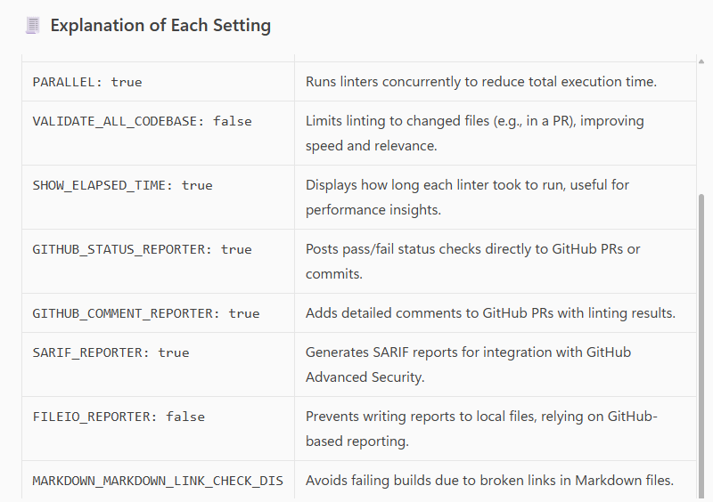
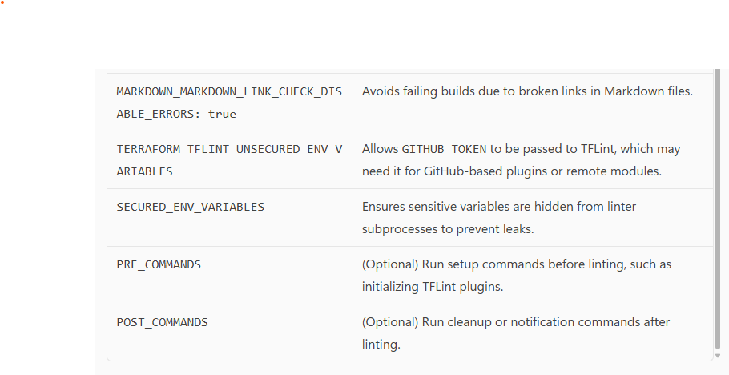

# Enable only the Terraform TFLint linter
ENABLE_LINTERS:
  - TERRAFORM_TFLINT

# Set logging level to show informative messages
LOG_LEVEL: INFO

# Run linters in parallel to improve performance
PARALLEL: true

# Only lint changed files (not the entire codebase)
VALIDATE_ALL_CODEBASE: false

# Show elapsed time for each linter execution
SHOW_ELAPSED_TIME: true

# Enable GitHub status checks (pass/fail indicators on PRs)
GITHUB_STATUS_REPORTER: true

# Enable GitHub comment reporting (detailed feedback on PRs)
GITHUB_COMMENT_REPORTER: true

# Enable SARIF report generation (for GitHub Advanced Security)
SARIF_REPORTER: true

# Disable writing reports to local files
FILEIO_REPORTER: false

# Suppress errors from broken Markdown links (optional)
MARKDOWN_MARKDOWN_LINK_CHECK_DISABLE_ERRORS: true

# Declare unsecured environment variables passed to TFLint
TERRAFORM_TFLINT_UNSECURED_ENV_VARIABLES:
  - GITHUB_TOKEN

# Add extra secured environment variables to protect secrets
SECURED_ENV_VARIABLES:
  - MY_SECRET_TOKEN
  - OX_API_KEY

# Optional: Run commands before linting (e.g., plugin install)
# PRE_COMMANDS:
#   - command: tflint --init
#     cwd: "workspace"

# Optional: Run commands after linting
# POST_COMMANDS:
#   - command: echo "Linting complete"
#     cwd: "workspace"

-----------------------------------

Explanation of Each Setting

 Explanation of Each Setting

KeyDescriptionENABLE_LINTERSActivates only the TERRAFORM_TFLINT linter, avoiding unnecessary checks from other linters.LOG_LEVEL: INFOSets the verbosity of logs to show general information without being too noisy.PARALLEL: trueRuns linters concurrently to reduce total execution time.VALIDATE_ALL_CODEBASE: falseLimits linting to changed files (e.g., in a PR), improving speed and relevance.SHOW_ELAPSED_TIME: trueDisplays how long each linter took to run, useful for performance insights.GITHUB_STATUS_REPORTER: truePosts pass/fail status checks directly to GitHub PRs or commits.GITHUB_COMMENT_REPORTER: trueAdds detailed comments to GitHub PRs with linting results.SARIF_REPORTER: trueGenerates SARIF reports for integration with GitHub Advanced Security.FILEIO_REPORTER: falsePrevents writing reports to local files, relying on GitHub-based reporting.MARKDOWN_MARKDOWN_LINK_CHECK_DISABLE_ERRORS: trueAvoids failing builds due to broken links in Markdown files.TERRAFORM_TFLINT_UNSECURED_ENV_VARIABLESAllows GITHUB_TOKEN to be passed to TFLint, which may need it for GitHub-based plugins or remote modules.SECURED_ENV_VARIABLESEnsures sensitive variables are hidden from linter subprocesses to prevent leaks.PRE_COMMANDS(Optional) Run setup commands before linting, such as initializing TFLint plugins.POST_COMMANDS(Optional) Run cleanup or notification commands after linting.
